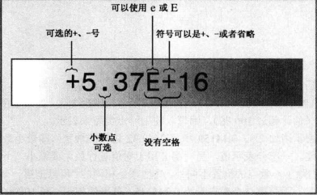
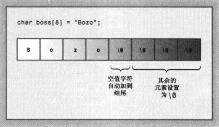

### 基础

#### cout
打印消息
```c++
cout << "what ?";

std::cout << "Hello";

cout << 33;
```
可以输出数字
#### 控制符 endl
重启一行/换行  和"\n" 同义
```c++
cout << endl;

cout << "Hello World!" << endl;
//连续输出
cout << "Hello World!" << "13213" << endl << "???";
```

#### 语法
```c++
void test2(){
    int steinway;
    int baldwin;
    int yamaha;
    yamaha = baldwin = steinway = 88;
    std::cout << yamaha;
}
```
赋值将从右向左传递，`88`将首先被赋给`steinway`。

#### cin
从键盘输入
```c++
int a;
std::cin >> a;
std::cout << a+1;
```

#### 无符号类型
如果 short 表示的范围为-32768 到+32767，则无符号版本的表示范围为 0-65535。
仅当数值不会为负时才应使用无符号类型，如人口、粒数等。
要创建无符号版本的基本整型，只需使用关键字unsigned 来修改声明即可。
```c++
unsigned x = 555;
unsigned short y = 40000;
```
`unsigned` 本身是 `unsigned int` 的缩写

#### const
常量，不可修改
```c++
const int Months = 12;
```

#### 浮点数
* 12.56
* 2.52e+8
* 8.33E-4
* 1.69e12

e6/E6表示乘以10的6次方，1.69e3 = 1.69*1000 = 1690



#### 表达式中的类型转换

```c++
short chickens = 20;
short ducks = 35;
short fowl = chickens + ducks;
```
为执行第 3 行语句，C++程序取得 chickens 和 ducks 的值，并将它们转换为 int。然后，程序将结果转换为 short 类型，因为结果将被赋给一个 short 变量。这种说法可能有点口，但是情况确实如此。通常将 int 类型选择为计算机最自然的类型，这意味着计算机使用这种类型时，运算速度可能最快。

C++11的校验表：
1. 如果有一个操作数的类型是 long double，则将另一个操作数转换为 long double。
2. 否则，如果有一个操作数的类型是 double，则将另一个操作数转换为 double。
3. 否则，如果有一个操作数的类型是 float，则将另一个操作数转换为 float。
4. 否则，说明操作数都是整型，因此执行整型提升。
5. 在这种情况下，如果两个操作数都是有符号或无符号的，且其中一个操作数的级别比另一个低则转换为级别高的类型。
6. 如果一个操作数为有符号的，另一个操作数为无符号的，且无符号作数的级别比有符号操作数高，则将有符号操作数转换为无符号操作数所属的类型。
7. 否则，如果有符号类型可表示无符号类型的所有可能取值，则将无符号操作数转换为有符号操作数所属的类型。
8. 否则，将两个操作数都转换为有符号类型的无符号版本。

### 复合类型

#### 数组 array

```c++
int yamcosts[3] = {20, 30, 6};
```

##### 数组的初始化规则
只有在定义数组时才能使用初始化，此后就不能使用了，也不能将一个数组赋给另一个数组:
```c++
int cards[4] = {1,3,5,6};   //okay
int hand[4];                //okay
hand = cards;               //not allowed
```

#### 字符串

C风格字符串具有一种特殊的性质：以空字符结尾，空字符被写作\0，其ASCII码为0，用来标记字符串的结尾。
```c++
char dog[8] = {'b','e','a','u','x',' ','i','i'};    //not a string
char cat[8] = {'b','e','a','u','x','s','a','\0'};   //a string
```
这两个数组都是 char 数组，但只有第二个数组是字符串。空字符对 C-风格字符串而言至关重要。例如C++有很多处理字符串的函数，其中包括 cout 使用的那些函数。它们都逐个地处理字符串中的字符，直到到达空字符为止。

另一种更好的方法：
```C++
char bird[11] = "Mr. Cheeps";    //the \0 is understood
char fish[] = "Bubbles";        //let the compiler count
```
C++对字符串长度没有限制。


字符串常量（双引号）不能与字符常量（单引号）互换。

